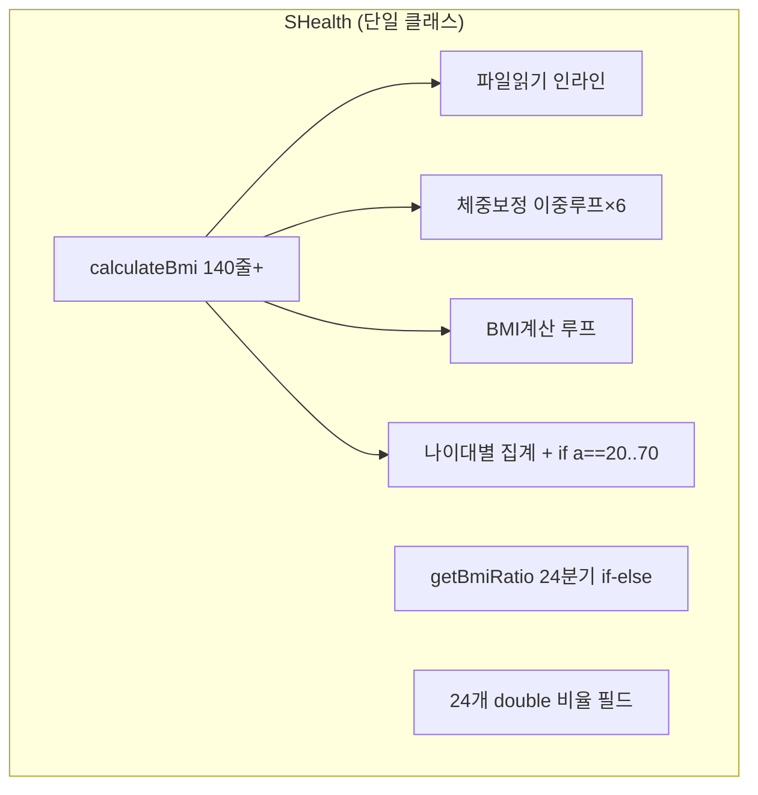
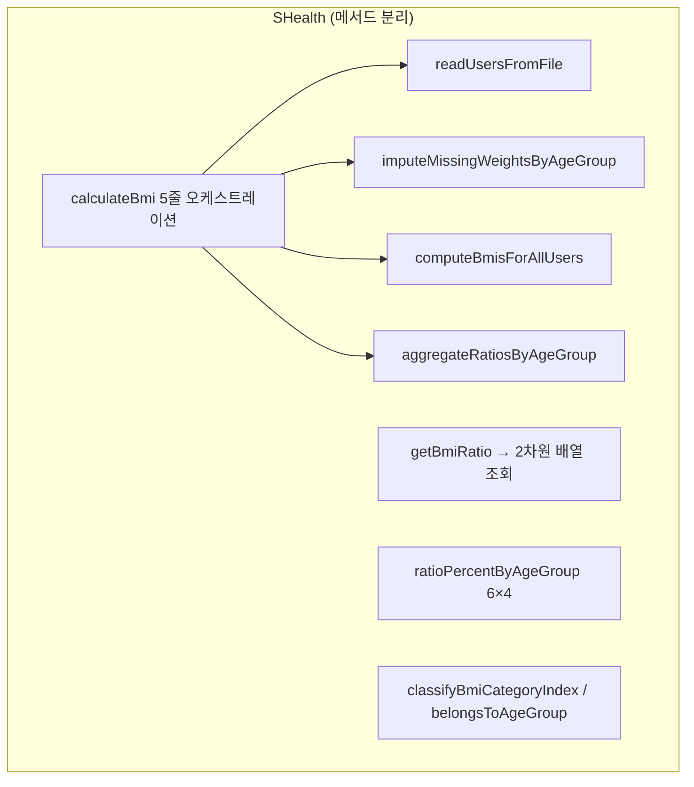

# 02. S_Health 1차 리팩토링 보고서

_작업시나리오 2단계 · SHealth BMI (Java) · 2026-05-19_

---

## 1. 수행 요약 (체크리스트)

| 단계 | 내용 | 상태 |
|------|------|------|
| 2-1 | 네이밍 개선 | ✅ |
| 2-2 | 하드코드·전역(인스턴스) 상태 정리 | ✅ |
| 2-3 | 함수 추출 (Extract Method) | ✅ |
| 2-4 | 반복·중복 제거 (DRY) | ✅ |

상세 체크·검증 로그: [`docs/02.S_Health_1차리팩토링_체크리스트.md`](../docs/02.S_Health_1차리팩토링_체크리스트.md)

**유지한 public API**

- `int calculateBmi(String filename)`
- `double getBmiRatio(int ageGroupStart, int bmiCategoryType)` — type: 100/200/300/400

---

## 2. 변경 전·후 구조

### Before



### After



| 항목 | Before | After |
|------|--------|-------|
| `SHealth.java` 라인 수 | 208 | 약 195 |
| 비율 저장 | 24개 필드 | `double[6][4]` |
| `getBmiRatio` | 50줄 if-else | switch + 인덱스 조회 |
| `calculateBmi` | 단일 Long Method | 4개 private 메서드 위임 |

---

## 3. 주요 리네이밍·상수화 목록

### 네이밍 (2-1)

| Before | After |
|--------|-------|
| `count` | `userCount` |
| `underweight20` … `obesity70` | `ratioPercentByAgeGroup[ageIdx][catIdx]` |
| `split(line, ',')` | `splitCsvLine(line, ',')` |
| `sum`, `ageCount` (보정 루프) | `nonZeroWeightSum`, `nonZeroWeightCount` |

### 상수화 (2-2)

| 상수 | 값 | 용도 |
|------|-----|------|
| `BMI_UNDERWEIGHT_MAX` | 18.5 | 저체중 경계 |
| `BMI_NORMAL_MAX` | 23.0 | 정상 상한 |
| `BMI_OVERWEIGHT_MAX` | 25.0 | 과체중 상한 |
| `AGE_GROUP_STARTS` | 20…70 | 나이대 시작 |
| `AGE_GROUP_WIDTH` | 10 | 구간 폭 |
| `TYPE_UNDERWEIGHT` … `TYPE_OBESITY` | 100/200/300/400 | 레거시 type 코드 |

---

## 4. 추출한 메서드 목록과 책임

| 메서드 | 책임 |
|--------|------|
| `readUsersFromFile` | CSV 헤더 스킵, 사용자 배열 적재 |
| `imputeMissingWeightsByAgeGroup` | `weight==0` → 동일 나이대 비-zero 체중 평균 |
| `computeBmisForAllUsers` | kg·cm → BMI |
| `aggregateRatiosByAgeGroup` | 나이대별 4분류 인원 집계·비율(%) 저장 |
| `classifyBmiCategoryIndex` | BMI → 분류 인덱스 (레거시 조건 유지) |
| `belongsToAgeGroup` | `[ageGroupStart, ageGroupStart+10)` 판별 |
| `storeRatioPercentages` | 분류별 % 계산·배열 저장 |
| `indexOfAgeGroupStart` / `indexOfCategoryType` | `getBmiRatio` 조회용 |

---

## 5. DRY로 제거한 중복 패턴

1. **나이대 20~70 루프** — `AGE_GROUP_STARTS` 배열 기반 단일 `for` (보정·집계 각 1회)
2. **`if (a == 20) … else if (a == 70)`** — `ageGroupIndex`로 `ratioPercentByAgeGroup`에 직접 저장
3. **BMI 분류 if-else** — `classifyBmiCategoryIndex` 한 곳으로 통합
4. **나이대 소속 조건** — `belongsToAgeGroup(age, ageGroupStart)` 헬퍼

---

## 6. 단계별 mvn test 검증 결과

| 시점 | 명령 | 결과 |
|------|------|------|
| 시작 전 | `mvn clean test` | **Red** — `SHealthBMITest.failedTest` 의도적 fail |
| 시작 전 (대체) | `mvn compile` + `SHealthBMI` main | 기준 비율 6개 나이대 캡처 |
| 2-1 ~ 2-4 · 최종 | `mvn clean test` | **Green** — `Tests run: 1, Failures: 0` |

**회귀 테스트 (2단계 스모크)**

- `SHealthBMITest.getBmiRatio_matchesLegacyBaseline_afterRefactoring`
- `shealth.dat` 처리 후 20~70대 × 4분류 비율이 리팩토링 전 스모크 값과 `DELTA=1e-4` 이내 일치

---

## 7. 유지한 API·알려진 제한사항

### API 호환

- `calculateBmi`, `getBmiRatio` 시그니처·반환 의미 동일
- 레거시 type 코드 100/200/300/400 유지 (`SHealth.TYPE_*` 상수로 노출)

### 의도적으로 유지한 레거시 동작 (3단계 TC 대상)

| 이슈 | 설명 |
|------|------|
| BMI = 25 미분류 | `obesity` 조건이 `> 25`라 25.0은 집계에서 제외 |
| `ageCount == 0` 나눗셈 | 나이대 전원 `weight==0` 시 `NaN` 가능 (기존과 동일) |
| IOException | `printStackTrace()` 유지 (4단계 또는 별도 이슈에서 개선) |
| 고정 배열 10000 | `MAX_USERS` 상수화만 수행, `List` 전환은 4단계 SRP 분리 시 |

### 3·4단계 권장 후속

- 3단계: BMI 계산·보정·분류 경계·예외 TC (`@ParameterizedTest`)
- 4단계: 클래스 분리, `height==0` 보정, 정상 BMI 목록, 전체 범주 비율

---

## 부록 — calculateBmi 오케스트레이션 (After)

```java
public int calculateBmi(String filename) {
    userCount = 0;
    readUsersFromFile(filename);
    imputeMissingWeightsByAgeGroup();
    computeBmisForAllUsers();
    aggregateRatiosByAgeGroup();
    return userCount;
}
```
