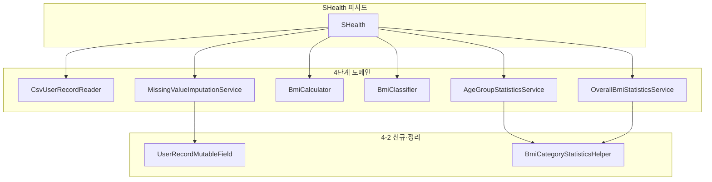

# 4-2단계 — 신규 기능 2차 리팩토링 보고서

_SHealth BMI · 완료일: 2026-05-20_

**상세 체크리스트:** [docs/04-2.S_Health_2차리팩토링_체크리스트.md](../docs/04-2.S_Health_2차리팩토링_체크리스트.md)

---

## 1. 수행 요약

| 단계 | 내용 | 결과 |
|------|------|------|
| 4-2-0 | 스캔·Green·REC 백로그 | ✅ |
| 4-2-1 | 네이밍 (4단계 범위) | ✅ |
| 4-2-2 | 하드코드·전역·상태 정리 | ✅ |
| 4-2-3 | 함수 추출 | ✅ |
| 4-2-4 | DRY (집계·보정·SHealthBMI) | ✅ |

public API(`calculateBmi`, `getBmiRatio`, `getOverallBmiRatio`, `getNormalBmiUserIds`) 시그니처·의미 유지.

---

## 2. 4단계 대비 구조·변경 범위

| 구분 | 4단계 | 4-2 추가·변경 |
|------|-------|----------------|
| 클래스 수 | 11 main | +2 (`UserRecordMutableField`, `BmiCategoryStatisticsHelper`) |
| SHealth 책임 | 파사드·파이프라인 | private 단계 메서드·상태 필드 네이밍 |
| 집계 | 서비스별 중복 루프 | 공통 헬퍼로 DRY |

---

## 3. 주요 리네이밍·상수화 목록

| Before | After | 위치 |
|--------|-------|------|
| `users` | `loadedUserRecords` | `SHealth` |
| `ageGroupStatistics` | `ageGroupStatisticsService` | `SHealth` |
| `overallStatistics` | `overallBmiStatisticsService` | `SHealth` |
| `csvReader` | `csvUserRecordReader` | `SHealth` |
| 리터럴 `4` (분류 수) | `BmiCategoryStatisticsHelper.CATEGORY_COUNT` | Statistics |
| `ToDoubleFunction` + enum identity | `UserRecordMutableField.WEIGHT/HEIGHT` | Imputation |

---

## 4. 추출·통합한 메서드·클래스 책임

| 클래스 | 추출·통합 메서드 | 책임 |
|--------|------------------|------|
| `SHealth` | `resetPipelineState`, `loadUserRecordsFromFile`, `imputeMissingWeightsAndHeights`, `buildStatisticsServices` | 파이프라인 단계·상태 초기화 |
| `MissingValueImputationService` | `computeNonZeroAverageInAgeGroup`, `imputeMissingValuesInAgeGroup` | 나이대별 평균·0 대체 |
| `CsvUserRecordReader` | `skipHeaderLine`, `readUserRecordLines`, `parseUserRecordLine` | CSV 읽기·파싱 |
| `BmiCategoryStatisticsHelper` | `countCategories`, `countCategoriesInAgeGroup`, `fillRatioPercentages` | 분류 건수·비율(%) 공통 |
| `UserRecordMutableField` | `WEIGHT`, `HEIGHT` | 체중·키 필드 접근 전략 |

---

## 5. DRY로 제거한 중복

| 패턴 | Before | After |
|------|--------|-------|
| 체중·키 보정 | `weightExtractor()` / `heightExtractor()` + identity 분기 | `UserRecordMutableField` 단일 알고리즘 |
| 나이대·전체 비율 | 각 서비스에 `%` 계산·카운트 루프 | `BmiCategoryStatisticsHelper` |
| `SHealthBMI` 출력 | 6회 동일 `printf` | `AGE_GROUP_STARTS` 루프 + type 배열 |

---

## 6. API 호환성·Test-Locked DEF·REC 반영

| 항목 | 조치 |
|------|------|
| public API | 시그니처 변경 없음 |
| DEF-01~06 (Test-Locked) | 리팩토링으로 규칙·반환값 변경 없음 |
| REC-12 | ✅ `SHealthBMI` 루프화 |
| REC-05, REC-09 | 4단계에서 이미 반영 — 4-2는 내부 품질만 |
| REC-01~04, 03, 06~08 | 결함 수정 범위 제외 — 미변경 |

---

## 7. mvn clean test 결과

| 항목 | 값 |
|------|-----|
| Tests run | 40 |
| Failures | 0 |
| Errors | 0 |
| Skipped | 0 |
| 결과 | **BUILD SUCCESS** |
