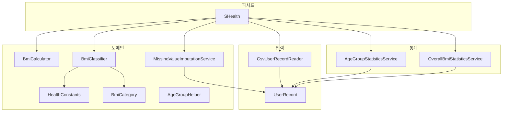
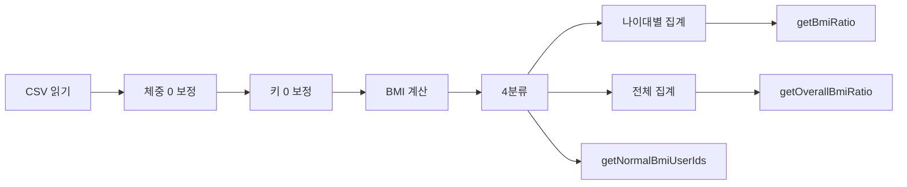

# 04. S_Health 기능 개선 보고서 (4단계)

_SHealth BMI · 4단계 PCTF · 갱신: 2026-05-20_

---

## 1. 패키지·클래스 구조

| 클래스 | 책임 |
|--------|------|
| `SHealth` | 파사드 — `calculateBmi`, `getBmiRatio`, 신규 API |
| `CsvUserRecordReader` | CSV 읽기·파싱 |
| `UserRecord` | id, age, weight, height, bmi, category |
| `MissingValueImputationService` | 체중·키 0 → 동일 나이대 평균 보정 (DRY) |
| `BmiCalculator` | BMI = kg / m² |
| `BmiClassifier` | 4분류 (명세 §5.3) |
| `AgeGroupStatisticsService` | 나이대별 비율(%) |
| `OverallBmiStatisticsService` | 전체 사용자 비율(%) |
| `HealthConstants` / `BmiCategory` / `AgeGroupHelper` | 상수·enum·나이대 유틸 |

---

## 2. 신규·변경 API

| 메서드 | 입력 | 출력 | 규칙 |
|--------|------|------|------|
| `calculateBmi(String filename)` | CSV 경로 | `int` 사용자 수 | 읽기 → 체중 보정 → **키 보정** → BMI → 분류 → 집계 |
| `getBmiRatio(int ageClass, int type)` | 20~70, 100/200/300/400 | `double` % | 나이대별 분류 비율; 빈 나이대 **0%** |
| `getOverallBmiRatio(int type)` | 100/200/300/400 | `double` % | **전체** 사용자 4분류 비율 |
| `getNormalBmiUserIds()` | — | `List<String>` | **18.5 < BMI < 23** 사용자 id |
| `classifyBmiCategoryIndex(double)` | BMI | 0~3 또는 -1 | **BMI ≥ 25 → 비만(3)** (DEF-01 해소) |

---

## 3. 처리 순서

---

## 4. 기능별 테스트 매핑

| 4단계 | 기능 | 테스트 클래스 | 픽스처·비고 |
|-------|------|---------------|-------------|
| 4-1 | SRP 분리 | 전체 `*Test` 회귀 | `SHealth` 파사드 위임 |
| 4-2 | 나이대별 비율 | `SHealthAgeGroupRatioTest`, `SHealthBMITest` | `single_normal_20s.csv`, `shealth.dat` |
| 4-3 | 키 0 보정 | `SHealthHeightImputationTest` | `impute_height_20s.csv` |
| 4-4 | 정상 BMI 목록 | `SHealthNormalBmiListTest` | `normal_bmi_three.csv` |
| 4-5 | 전체 범주 비율 | `SHealthOverallBmiRatioTest` | `overall_ratio_four.csv` |
| DEF-03 | 전원 weight=0 가드 | `SHealthWeightImputationGuardTest` | `all_zero_weight_20s.csv` |
| DEF-01 | BMI=25 비만 | `SHealthBmiClassificationTest` | `25.0 → 3` |
| DEF-02 | 빈 나이대 0% | `SHealthAgeGroupRatioTest` | 30대 무인원 → 0.0 |

---

## 5. API 호환성·DEF/REC 해소·잔여 제한

### 해소 (4단계)

| ID | 조치 |
|----|------|
| DEF-01 / REC-01 | `BmiClassifier`: BMI ≥ 25 비만; TC `25.0 → 3` |
| DEF-02 / REC-02 | `usersInAgeGroup==0` → 0% (NaN 제거) |
| DEF-03 / REC-06 | `nonZeroCount==0` 시 보정 스킵 |
| DEF-04 / REC-04 | `MissingValueImputationService` 키 0 보정 |
| REC-05 | SRP 9클래스 분리 |
| REC-10 | `getNormalBmiUserIds` + TC |
| REC-11 | `getOverallBmiRatio` + TC |

### 유지·잔여

| ID | 상태 | 비고 |
|----|------|------|
| DEF-05 / REC-03 | Test-Locked | I/O 실패 시 `printStackTrace` + count=0 (기존 TC 유지) |
| DEF-06 / REC-08 | Open | 잘못된 `ageClass`/`type` → 0.0 반환 |
| REC-09 | 미이관 | `List<UserRecord>` 전환은 4단계 범위 외(배열 대신 List 사용) |

### 하위 호환

- `calculateBmi`, `getBmiRatio` 시그니처·type 코드(100/200/300/400) 유지
- `SHealthBMITest` shealth.dat 기준선 **Green** (DEF-01 반영 후에도 수치 일치)

---

## 6. mvn clean test 결과

| 항목 | 값 |
|------|-----|
| 명령 | `mvn clean test` |
| 결과 | **SUCCESS** |
| Tests run | **40** |
| Failures | **0** |
| Errors | **0** |
| Skipped | **0** |

신규 테스트: `SHealthHeightImputationTest`, `SHealthNormalBmiListTest`, `SHealthOverallBmiRatioTest`, `SHealthWeightImputationGuardTest` (4건).

---

_End of Document_
