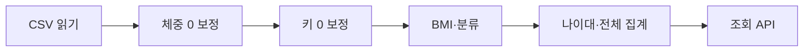

# 06. S_Health 회고 및 발표 보고서 (6단계)

_SHealth BMI · 6단계 PCTF · 갱신: 2026-05-20_

**관련 docs:**

- [`docs/06.S_Health_작업프롬프트_순차리뷰.md`](../docs/06.S_Health_작업프롬프트_순차리뷰.md)
- [`docs/06.S_Health_AI코드_리뷰.md`](../docs/06.S_Health_AI코드_리뷰.md)
- [`docs/06.S_Health_회고발표_5분.md`](../docs/06.S_Health_회고발표_5분.md) (PDF 원고)

---

## 1. 실습 목표와 달성도

### 1.1 목표 (재정의)

1. 레거시 BMI 코드를 이해하고 **코드 스멜·결함**을 체계적으로 식별한다.
2. **리팩토링·단위 테스트·기능 개선**으로 품질을 높이고 AI를 활용한다.
3. **결함 관리·메트릭**까지 이어지는 문서·프로세스를 경험한다.

### 1.2 단계별 달성

| 단계 | 목표 한 줄 | 결과 | docs·Report 근거 |
|------|------------|------|------------------|
| 1 | 스멜·잠재 BUG 분석 | ✅ | `docs/01.*`, `Report/01.*` |
| 2 | 1차 클린코드 리팩토링 | ✅ | `docs/02.*`, `Report/02.*` |
| 3 | UnitTest TS-01~06 | ✅ | `docs/03.*`, 40 TC Green |
| 3-2 | DEF/REC 통합 | ✅ | `docs/03-2.*`, `Report/03-2.*` |
| 4 | SRP·신규 API | ✅ | `Report/04.*` |
| 4-2 | 2차 리팩토링 | ✅ | `docs/04-2.*`, `Report/04-2.*` |
| 5 | 결함·메트릭 체계 | ✅ | `docs/05.*`, `Report/05.*` |
| 6 | 회고·발표·리뷰 | ✅ | 본 Report, `docs/06.*` |

### 1.3 잔여 기술 부채

| # | 항목 | ID | 비고 |
|---|------|-----|------|
| 1 | I/O 실패 silent | DEF-05 | Test-Locked |
| 2 | 잘못된 ratio 인자 → 0% | DEF-06 | Open |
| 3 | IOException 정책 미정 | REC-03 | P1 |

---

## 2. 코드 품질 Before & After

### 2.1 구조 비교

| 항목 | Before (1단계) | After (4-2) |
|------|----------------|-------------|
| main 클래스 | `SHealth.java` 1개 God Class | 12개 도메인 클래스 + 파사드 |
| 데이터 | 고정 배열 10000 | `List<UserRecord>` |
| 비율 저장 | 24개 필드 | 2차원 배열 → `BmiCategoryStatisticsHelper` |
| TC | 1건(회귀) | **40건** Green |
| API | calculateBmi, getBmiRatio | + getOverallBmiRatio, getNormalBmiUserIds |

### 2.2 처리 흐름 (After)



### 2.3 1단계 Top 5 스멜 — 해결/잔존

| 순위 | 스멜 | 상태 |
|------|------|------|
| 1 | calculateBmi 비대 | ✅ 함수·SRP 분리 |
| 2 | God Class | ✅ 4단계 |
| 3 | 매직 넘버 | ✅ HealthConstants |
| 4 | 나이대 if 체인 | ✅ 루프·Map |
| 5 | 경계·예외 | △ DEF-05·06 잔여 |

### 2.4 코드 인용 (Before vs After 개념)

**Before:** `SHealth` 단일 클래스에 읽기·보정·BMI·집계·비율 필드 24개 혼재.

**After:** 파사드 파이프라인만 노출:

```25:34:src/main/java/com/bestreviewer/SHealth.java
    public int calculateBmi(String filename) {
        resetPipelineState();
        if (!loadUserRecordsFromFile(filename)) {
            return 0;
        }
        imputeMissingWeightsAndHeights();
        computeBmisAndClassify();
        buildStatisticsServices();
        return loadedUserRecords.size();
    }
```

---

## 3. 생성형 AI 활용 회고

### 3.1 단계별 활용 유형

| 단계 | 프롬프트 유형 | 예시 |
|------|---------------|------|
| 0~N | PCTF 작성 요청 | "PCTF 만들어줘" → `작업프롬프트/N단계_PCTF.md` |
| 실행 | 복사 블록 + `@` 첨부 | `@docs/`, `@작업프롬프트/4단계_PCTF.md` |
| 검증 | mvn test 결과 피드백 | 2·3·4-2 단계 |
| 마일스톤 | Git 브랜치·PR | TC / feature / qa |

### 3.2 도움이 된 순간 (3)

1. **PCTF 복사 블록** — Persona·Task·Format 고정으로 범위 이탈 감소.
2. **경계값 TC·픽스처 설계** — `docs/03` 계획서·`impute_height_20s.csv` 등.
3. **4-2 DRY 제안** — `BmiCategoryStatisticsHelper`, `UserRecordMutableField`.

### 3.3 한계 (3)

1. BMI=25 등 **명세 경계**는 TC로 사람이 재확인 필요했음.
2. **과도한 파일 분리** 제안 → 단계 범위로 조절.
3. I/O·invalid 인자 등 **비즈니스 정책**은 AI가 임의 변경하지 않도록 PCTF에 금지 명시 필요.

### 3.4 Human-in-the-loop

- DEF-01: `BmiClassifier` BMI≥25 수정 후 `SHealthBmiClassificationTest` 25.0→3 기대값 검토.
- `SHealthBMITest` shealth.dat 기준선 — DEF-01 반영 후에도 Green 유지 확인.

---

## 4. 단위 테스트 영향과 작성 팁

### 4.1 Red→Green 사례

| 이슈 | 조치 | TC |
|------|------|-----|
| BMI=25 미분류 | `BmiClassifier` 수정 | TC-03-02 |
| 빈 나이대 NaN | usersInAgeGroup==0 → 0% | TC-05-02 |

### 4.2 리팩토링 안전망

2단계 리팩토링 → 3단계 40 TC → 4·4-2 단계에서 **회귀 없이** SRP·DRY 적용.

### 4.3 작성 팁 (5)

1. **Given–When–Then** `@DisplayName` 한글.
2. **@ParameterizedTest**로 BMI·나이 경계.
3. **소규모 CSV 픽스처** — 전체 dat 의존 최소화.
4. 단계 마감마다 **`mvn clean test`**.
5. Test-Locked DEF 수정 시 **TC 선행 갱신**.

---

## 5. 클린코드·리팩토링 소감

### 5.1 장점

- 가독성·변경 용이성(SRP 후 신규 API 추가 용이).
- TC로 리팩토링 자신감.
- docs·Report로 **단계 산출물 추적** 가능.

### 5.2 어려운 점

- public API 하위 호환 유지 부담.
- Test-Locked 레거시(I/O)와 신규 명세의 공존.
- 1차(2단계) vs 2차(4-2) 리팩토링 범위 구분.

### 5.3 Takeaway

> **"PCTF + docs + mvn test"** 세 가지를 고정하면 AI 보조 실습도 재현 가능한 엔지니어링 프로세스가 된다.

---

## 6. 결함 관리·품질 메트릭 (5단계)

| ID | 메트릭 | 값 | 목표 |
|----|--------|-----|------|
| QM-01 | TC 통과율 | 100% | 100% |
| QM-02 | TC 건수 | 40 | ≥40 |
| QM-03 | DEF Open | 1 | 0 |
| QM-04 | DEF Resolved | 4 | — |
| QM-05 | Test-Locked | 1 | — |
| QM-07 | TS 커버 | 6/6 | 6/6 |

상세: [`docs/05.S_Health_품질메트릭수집계획.md`](../docs/05.S_Health_품질메트릭수집계획.md) §6

---

## 7. 발표 스크립트 (5분)

| 슬라이드 | 말할 내용 (요약) | 시간 |
|----------|------------------|------|
| 1 표지 | SHealth BMI 실습, 1~5단계, 생성형 AI | 0:30 |
| 2 목표·달성 | 3목표, 7단계 ✅, docs 기반 | 1:00 |
| 3 Before/After | God Class→12클래스, TC 40 | 1:00 |
| 4 AI·프롬프트 | PCTF·@docs, 프롬프트 순차 리뷰 | 1:00 |
| 5 테스트·결함 | DEF 4 해소, QM 100% | 1:00 |
| 6 Takeaway | 테스트·docs·메트릭 | 0:30 |

PDF: [`docs/06.S_Health_회고발표_5분.pdf`](../docs/06.S_Health_회고발표_5분.pdf) 또는 [`docs/06.S_Health_회고발표_5분.md`](../docs/06.S_Health_회고발표_5분.md) 인쇄

---

## 8. 작업 프롬프트 순차 리뷰 요약

→ **상세:** [`docs/06.S_Health_작업프롬프트_순차리뷰.md`](../docs/06.S_Health_작업프롬프트_순차리뷰.md)

| 항목 | 요약 |
|------|------|
| PCTF 파일 | 00 목차 + 1~6, 3-2, 4-2 (9종) |
| Prompt | 1~43 (`S_Health_prompt_user.md`) |
| 패턴 | PCTF 작성 → 복사 블록 실행 → @첨부 → mvn → Git |
| 순서 | 3-2(통합) → 4(구현) → 4-2(품질) → 5(QA체계) — 적절 |
| 한 줄 | "작업프롬프트로 범위를 고정하고 docs를 첨부해 단계를 쌓았다." |

---

## 9. AI 작성 코드 리뷰 요약

→ **상세:** [`docs/06.S_Health_AI코드_리뷰.md`](../docs/06.S_Health_AI코드_리뷰.md)

| 항목 | 요약 |
|------|------|
| 구조 | 파사드 + 9 도메인 클래스, 4-2 DRY |
| 명세 | DEF-01~04 Resolved, 40 TC Green |
| 잔여 | DEF-05(I/O), DEF-06(0% sentinel) |
| 종합 | **4/5** — 실습 목적 달성 |

---

## 부록 A. 프롬프트 이력

- `prompting/S_Health_prompt_user.md` — Prompt 1~43
- 단계별: `prompting/01~05.S_Health_*_prompt.md`

## 부록 B. mvn clean test 최종 로그

```
Tests run: 40, Failures: 0, Errors: 0, Skipped: 0
BUILD SUCCESS
```

(Report/04 §6, 2026-05-20 기준)

## 부록 C. docs/ 파일 목록

| 파일 | 단계 |
|------|------|
| 01.S_Health_코드스멜_분석보고서.md | 1 |
| 02.S_Health_1차리팩토링_체크리스트.md | 2 |
| 03.S_Health_단위테스트계획서.md | 3 |
| 03-2.S_Health_결함_레지스터.md | 3-2 |
| 03-2.S_Health_권장사항_레지스터.md | 3-2 |
| 04-2.S_Health_2차리팩토링_체크리스트.md | 4-2 |
| 05.S_Health_결함분류체계.md | 5 |
| 05.S_Health_보고서템플릿.md | 5 |
| 05.S_Health_품질메트릭수집계획.md | 5 |
| 06.S_Health_작업프롬프트_순차리뷰.md | 6 |
| 06.S_Health_AI코드_리뷰.md | 6 |
| 06.S_Health_회고발표_5분.md / .pdf | 6 |

---

_End of Document_
