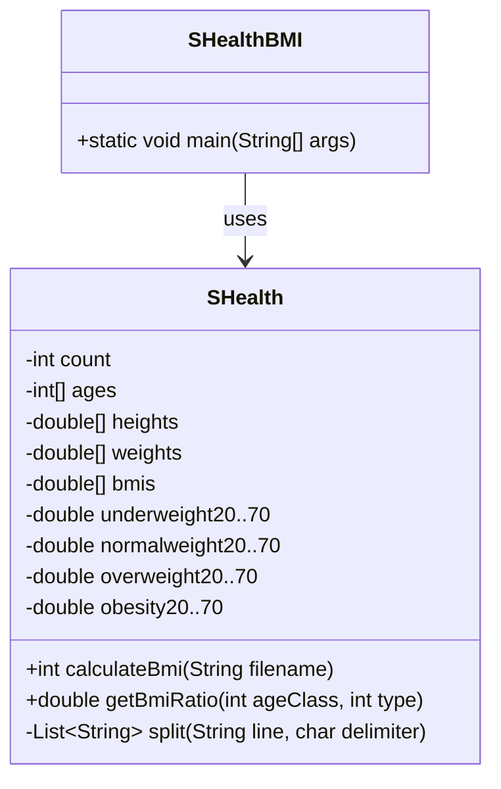
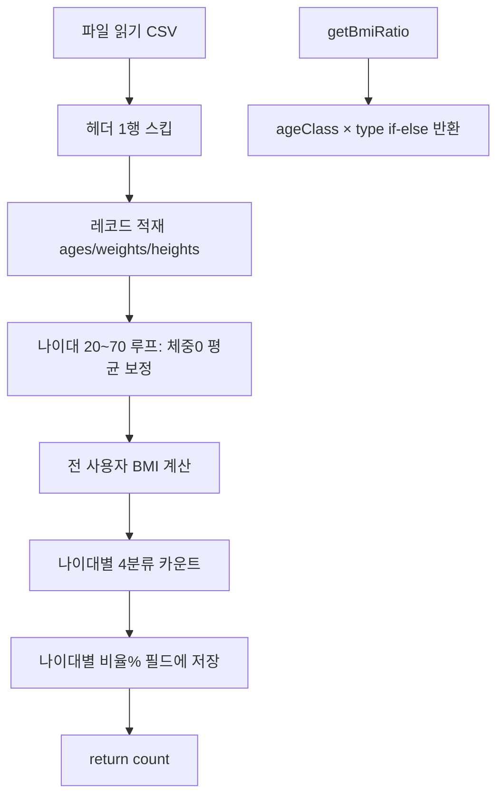

# SHealth BMI — 1단계 코드 스멜 분석 보고서

| 항목 | 내용 |
|------|------|
| 문서명 | 01.S_Health_코드스멜_분석보고서 |
| 프로젝트 | SHealth BMI (Java) — `com.bestreviewer` |
| 단계 | 작업시나리오 1단계 — 문제 코드 분석 및 코드 스멜 찾기 |
| 참조 | `SHealthRequirements.txt`, `README.md`, `.cursorrules`, `작업시나리오` |
| 분석 대상 | `SHealth.java`, `SHealthBMI.java`, `SHealthBMITest.java` |
| 작성 원칙 | **코드 수정 없음** (분석·문서화만) |

---

## 1. 코드 구조 요약

### 1.1 클래스 역할

| 클래스 | 역할 | 비고 |
|--------|------|------|
| `SHealth` | CSV 로드, 체중 보정, BMI 계산, 분류·비율 집계, `getBmiRatio` 조회 | **핵심 도메인·인프라가 한 클래스에 집중** |
| `SHealthBMI` | `main` — `shealth.dat` 로드 후 콘솔에 나이대별 4분류 비율 출력 | 실행·표현 계층 |
| `SHealthBMITest` | JUnit 5 테스트 클래스 | `fail()`만 있는 **플레이스홀더** (실질 테스트 없음) |

### 1.2 인스턴스 필드 구조



| 필드 그룹 | 개수 | 용도 |
|-----------|------|------|
| `count`, `ages[]`, `heights[]`, `weights[]`, `bmis[]` | 5 | 사용자 원시·파생 데이터 (고정 길이 10000) |
| `underweight20` ~ `obesity70` | 24 | 나이대(6) × 분류(4) 비율(%) — **개별 필드로 중복 선언** |

- CSV의 **id**는 파싱하지 않고 버림 (`tokens.get(1~3)`만 사용).
- 모든 비율·배열은 **인스턴스 가변 상태** — `calculateBmi` 호출 시마다 덮어씀.

### 1.3 처리 흐름 (`calculateBmi`)



**요구사항 처리 순서 대조** (`SHealthRequirements.txt` §7)

| 단계 | 요구사항 | 구현 위치 | 일치 |
|------|----------|-----------|------|
| [1] 파일 읽기 | shealth.dat, 헤더 스킵 | L43~55 | ✅ |
| [2] 레코드 적재 | id, age, weight, height | L51~54 (id 미저장) | △ |
| [3] 체중 0 보정 | 동일 나이대 평균 | L61~80 | ✅ (엣지 예외 있음) |
| [4] BMI 계산 | kg / (m)² | L83~85 | ✅ |
| [5] BMI 분류 | 4분류 | L97~105 | △ (경계값 이슈) |
| [6] 나이대별 비율 | % 집계 | L88~138 | ✅ (sum=0 위험) |
| [7] 조회 | getBmiRatio | L143~194 | ✅ |

### 1.4 `getBmiRatio(ageClass, type)` 매핑

| type | 의미 | 반환 필드 예 |
|------|------|----------------|
| 100 | 저체중 | `underweight20` … `underweight70` |
| 200 | 정상체중 | `normalweight20` … |
| 300 | 과체중 | `overweight20` … |
| 400 | 비만 | `obesity20` … |

| ageClass | 나이 구간 |
|----------|-----------|
| 20 | `[20, 30)` |
| 30 | `[30, 40)` |
| … | … |
| 70 | `[70, 80)` |

- 잘못된 `ageClass`/`type` 조합 → `0.0` 반환 (오류·미집계와 구분 불가).

---

## 2. BMI·보정·분류 로직 설명

### 2.1 CSV 파싱 (L43~55)

1. `BufferedReader` + `FileReader`로 파일 오픈.
2. `br.readLine()` 1회 — 헤더 스킵.
3. 이후 행: `split(line, ',')` → `age`, `weight`, `height`만 `count` 인덱스에 저장.
4. `tokens.size() == 0`이면 루프 종료.

### 2.2 체중 0 보정 (L61~80)

**알고리즘 (나이대 `a` = 20, 30, …, 70)**

1. **1차 루프**: 구간 `[a, a+10)` 내 `weight != 0`인 값의 합·개수 → `sum`, `ageCount`.
2. **2차 루프**: 같은 구간 내 `weight == 0`이면 `weights[i] = sum / ageCount`.

| 요구사항 | 구현 | 일치 |
|----------|------|------|
| weight==0만 누락 | `weights[i] == 0.0` | ✅ |
| 동일 나이대 비-zero 평균 | 1차 루프 로직 | ✅ |
| 보정 후 BMI 계산 | 보정 블록(L61~80) → BMI(L83~85) 순서 | ✅ |

### 2.3 BMI 계산 (L83~85)

```text
BMI = weight / ((height / 100.0) * (height / 100.0))
```

- cm → m: `height / 100.0` — 요구사항(TS-01)과 일치.

### 2.4 4분류 (L97~105) vs 요구사항

| 분류 | 요구사항 (`SHealthRequirements.txt` §5) | 코드 조건 | 일치 |
|------|----------------------------------------|-----------|------|
| 저체중 | BMI ≤ 18.5 | `bmis[i] <= 18.5` | ✅ |
| 정상 | 18.5 < BMI < 23 | `bmis[i] > 18.5 && bmis[i] < 23` | ✅ |
| 과체중 | 23 ≤ BMI < 25 | `bmis[i] >= 23 && bmis[i] < 25` | ✅ |
| 비만 | BMI ≥ 25 | `bmis[i] > 25` | ❌ **25 누락** |

### 2.5 나이대별 비율 (L88~138)

- 구간별 `underweight`, `normalweight`, `overweight`, `obesity`, `sum` 카운트.
- `비율(%) = 분류 인원 / sum * 100` → `underweight20` 등 24개 필드에 저장.
- `a == 20` … `a == 70` 각각 **6개 분기 if-else**로 동일 식 4줄 반복.

### 2.6 예외·엣지 케이스

| 케이스 | 현재 동작 | 위험도 |
|--------|-----------|--------|
| `IOException` | `printStackTrace()` 후 빈 데이터로 후속 처리 | High |
| `ageCount == 0` (구간 내 전원 weight=0) | `sum / ageCount` → **ArithmeticException** | High |
| `sum == 0` (해당 나이대 사용자 없음) | `* 100 / sum` → **ArithmeticException** | High |
| `height == 0` | BMI 분모 0 → **Infinity/NaN** | High |
| 나이 `[0,20)`, `[80,∞)` 등 | 20~70 루프에 미포함, weight=0 미보정 | Medium |
| BMI = 25.0 | 어느 분류에도 미포함 (**미분류**) | High |
| id 미저장 | 4단계 “정상 BMI 사용자 목록” 구현 시 재설계 필요 | Medium (향후) |

---

## 3. 코드 스멜 목록

| # | 스멜 유형 | 위치 | 증상 | 위반 원칙 | 개선 방향 | 우선순위 |
|---|-----------|------|------|-----------|-----------|----------|
| 1 | **Long Method** | `SHealth.calculateBmi` L41~140 | 읽기·보정·계산·집계·저장이 한 메서드 (~100줄) | **SRP** | `loadRecords`, `imputeMissingWeights`, `computeBmis`, `aggregateRatiosByAgeGroup` 등 단계별 private 메서드 추출 | **High** |
| 2 | **God Class / Large Class** | `SHealth` 전체 | I/O, 파싱, 도메인, 통계, 조회 API가 한 클래스 | **SRP**, **OCP** | Reader/Parser, `UserRecord`, `BmiClassifier`, `AgeGroupStatistics` 등 책임 분리 (4단계) | **High** |
| 3 | **Duplicate Code** | L61~80 vs L88~107 | 나이대 `[a,a+10)` 필터링 3회 반복 | **DRY** | `forEachInAgeGroup(a, consumer)` 또는 Stream/filter 공통화 | **High** |
| 4 | **Duplicate Code** | L108~138 | 6개 나이대 × 4줄 동일 할당 패턴 | **DRY** | `double[6][4]` 또는 `Map<AgeGroup, EnumMap<BmiCategory, Double>>` | **High** |
| 5 | **Long Parameter List / Switch** | `getBmiRatio` L143~194 | 24분기 if-else (6×4) | **OCP**, **DRY** | `enum BmiCategory`, `enum AgeGroup` + Map/배열 조회 | **High** |
| 6 | **Magic Number** | 전역 | `18.5`, `23`, `25`, `100`, `200`, `300`, `400`, `10000`, `20~70` | 가독성, 유지보수 | named constant / enum (`BMI_*`, `BmiRatioType`) | **High** |
| 7 | **Primitive Obsession** | L11~14 | 병렬 배열 4개 + count | 응집도 | `List<UserRecord>` 또는 도메인 객체 | **Medium** |
| 8 | **Data Clumps** | L11~14, L16~39 | age/weight/height/bmi + 24 비율 필드가 항상 함께 | **DRY** | `AgeGroupStats`, `UserRecord`로 묶기 | **Medium** |
| 9 | **Mutable Global State** | 인스턴스 필드 29개 | 호출 순서·재호출에 의존, 테스트 어려움 | 테스트성, **SRP** | 계산 결과를 반환값/DTO로 전달, 필드 최소화 | **Medium** |
| 10 | **Fixed Array Size** | `new int[10000]` 등 | 실제 건수와 무관한 고정 상한 | 유연성 | `ArrayList` 또는 동적 크기 | **Medium** |
| 11 | **Swallowed Exception** | L56~58 | `printStackTrace()`만, 호출자는 count만 수신 | 실패 명시 | 예외 전파 또는 `Optional`/Result 타입 | **Medium** |
| 12 | **Dead / Missing Data** | L51~53 | CSV `id` 미사용 | 요구 완전성 | `UserRecord`에 id 포함 (4단계 목록 기능 대비) | **Low** (4단계) |
| 13 | **Duplicated Code** | `SHealthBMI` L11~16 | 6줄 거의 동일 `printf` | **DRY** | 루프 + `getBmiRatio` | **Low** |
| 14 | **Lack of Tests** | `SHealthBMITest` | `fail()` 단일 테스트 | TDD | 3단계에서 TS-01~06 커버 | **High** (3단계) |
| 15 | **Comments as Noise** | L45, L60 등 | “첫번째 줄 읽기” 등 코드와 중복 설명 | Clean Code | 의미 있는 메서드명으로 대체 후 제거 | **Low** |
| 16 | **Reinventing the Wheel** | `split` L196~207 | CSV 수동 파싱 | 단순성 | `String.split(",")` 또는 CSV 라이브러리 (과도한 의존은 지양) | **Low** |

---

## 4. 요구사항 대비 잠재 결함·경계값 이슈

| ID | 이슈 | 코드 근거 | 요구사항 | 영향 | 2단계/3단계 대응 |
|----|------|-----------|----------|------|------------------|
| **BUG-01** | **BMI = 25 미분류** | L103 `bmis[i] > 25` (25 제외) | §5.1 비만: **BMI ≥ 25** | 비만 1건 누락, 4분류 합 < sum | `>= 25` 또는 명세·테스트로 확정 후 수정 |
| **BUG-02** | **빈 나이대 나눗셈** | L109 `... / sum` when sum=0 | §6.3, TS-05 | 런타임 예외 | sum==0 가드 + 0% 반환 정책 |
| **BUG-03** | **전원 weight=0 구간** | L76 `sum / ageCount` | §4.2, TS-02 | 런타임 예외 | ageCount==0 처리 |
| **BUG-04** | **height=0** | L84 분모 0 | TS-01 (확장) | Infinity/NaN → 분류 왜곡 | 4단계 키 0 보정 선행 |
| **BUG-05** | **I/O 실패 후 silent 진행** | L56~58 catch | TS-06 | count=0인데 “성공”처럼 보임 | 예외 전파·실패 반환 |
| **EDGE-01** | 나이 19, 79 등 | 20~70 루프만 | §4.3 | 해당 연령 weight=0 미보정 | 요구 범위 확인 후 문서화 |
| **EDGE-02** | `getBmiRatio` 잘못된 인자 | L193 `return 0.0` | §6.5 | 오류와 “0%” 구분 불가 | Optional 또는 예외 |
| **EDGE-03** | 정상 경계 18.5 | L97 `<=18.5` 저체중 | §5.1 “18.5 이하” | 18.5는 저체중 (요구와 일치) | TS-03으로 고정 |
| **EDGE-04** | 정상 상한 23 | L99 `< 23` | “23 미만” | 23.0은 과체중 — 일치 | TS-03 |

### 경계값 대조표 (분류)

| BMI 값 | 요구 분류 | 코드 분류 | 결과 |
|--------|-----------|-----------|------|
| 18.5 | 저체중 | 저체중 (`<=18.5`) | ✅ |
| 18.5001 | 정상 | 정상 | ✅ |
| 23.0 | 과체중 | 과체중 (`>=23 && <25`) | ✅ |
| 24.999 | 과체중 | 과체중 | ✅ |
| **25.0** | **비만** | **없음** | ❌ BUG-01 |
| 25.001 | 비만 | 비만 (`>25`) | ✅ |

---

## 5. 2단계 리팩토링 우선순위 Top 5

| 순위 | 대상 | 이유 | 2단계 작업시나리오 연결 |
|------|------|------|-------------------------|
| **1** | `calculateBmi` **함수 추출** (로드 / 보정 / BMI / 집계) | 가독성·SRP·단위 테스트 준비의 기반 | 함수 추출 |
| **2** | **매직 넘버 상수화** (18.5, 23, 25, 100/200/300/400, 나이대) | 분류·조회 로직 한곳에서 관리, BUG-01 수정 용이 | 하드코드 제거 |
| **3** | **나이대 루프·비율 저장 DRY** (L61~80, L108~138) | 중복 제거, 버그 수정 포인트 단일화 | 반복/중복 제거 |
| **4** | **24개 비율 필드 → 구조화** (`getBmiRatio` 단순화) | Shotgun Surgery 방지, 네이밍 개선 기회 | 네이밍·전역 상태 축소 |
| **5** | **예외 처리 정리** (I/O, sum=0, ageCount=0) | TS-05/06 및 런타임 안정성 | (3단계 테스트와 병행) |

> **권장 순서**: 3단계에서 `SHealthBMITest`의 `fail()` 제거 후 최소 Golden/단위 테스트 추가 → **2단계 리팩토링** → BUG-01 등은 **테스트로 고정한 뒤** 수정 (`.cursorrules` TDD 규칙).

---

## 부록: `SHealthBMI` 요약

- `main`에서 `calculateBmi("shealth.dat")` 1회 호출.
- 20~70대 각 4분류 비율을 `System.out.printf`로 출력 — **검증은 눈으로만 가능** (`.cursorrules`에서 비권장).
- 파일 경로 하드코딩 (`"shealth.dat"`).

---

_End of Document_
