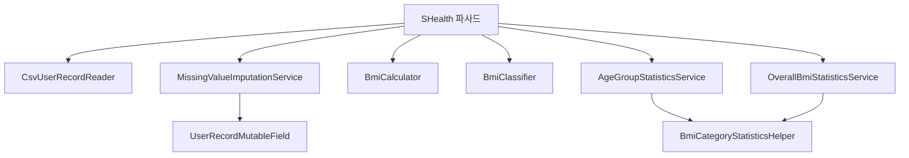

# 06. S_Health AI 작성 코드 리뷰

_SHealth BMI · 6단계 · 갱신: 2026-05-20_

**리뷰 대상:** `src/main/java/com/bestreviewer/` (AI 보조 2~4-2단계) · **기준:** `SHealthRequirements.txt` · **검증:** `mvn clean test` 40/40 Green

---

## 1. 리뷰 목적·범위

| 항목 | 내용 |
|------|------|
| 목적 | AI가 생성·리팩토링한 코드의 **품질·명세 정합·유지보수성** 평가 |
| 범위 | 4단계 SRP 분리 클래스 + 4-2 DRY·네이밍 (레거시 `SHealthBMI`는 데모용) |
| 방법 | 정적 구조 리뷰 + docs/03-2 DEF·Report/04·TC 결과 교차 |
| 금지 | 본 문서 작성 시 **코드 변경 없음** (리뷰 기록만) |

---

## 2. 패키지 구조 요약



| 클래스 | 책임 | AI 단계 | 평가 |
|--------|------|---------|------|
| `SHealth` | 파사드·파이프라인 | 4, 4-2 | 얇은 위임 ✅ |
| `CsvUserRecordReader` | CSV 파싱 | 4, 4-2 | 단일 책임 ✅ |
| `UserRecord` | 도메인 모델 | 4 | 적절 ✅ |
| `MissingValueImputationService` | 체중·키 보정 | 4, 4-2 | DRY 개선 ✅ |
| `BmiCalculator` / `BmiClassifier` | BMI·분류 | 4 | 명세 §5 반영 ✅ |
| `AgeGroupStatisticsService` / `OverallBmiStatisticsService` | 집계 | 4, 4-2 | 헬퍼 공통화 ✅ |
| `BmiCategoryStatisticsHelper` | 비율 계산 DRY | 4-2 | 중복 제거 ✅ |
| `UserRecordMutableField` | 보정 필드 전략 | 4-2 | 가독성 ↑ ✅ |
| `HealthConstants` / `BmiCategory` / `AgeGroupHelper` | 상수·유틸 | 4 | 일원화 ✅ |

---

## 3. 강점 (잘된 점)

### 3.1 아키텍처·SRP (4단계)

- God Class → **파사드 + 9개 도메인 클래스**로 분리, `calculateBmi` 파이프라인이 읽기 쉬움.
- public API(`calculateBmi`, `getBmiRatio`, `getOverallBmiRatio`, `getNormalBmiUserIds`) **하위 호환 유지**.
- 처리 순서: 읽기 → 체중 보정 → 키 보정 → BMI·분류 → 집계 — `SHealthRequirements.txt` 흐름과 일치.

### 3.2 명세 정합 (4단계 TC 기준)

| 항목 | 구현 | TC·문서 |
|------|------|---------|
| BMI ≥ 25 비만 | `BmiClassifier` | DEF-01 Resolved |
| 빈 나이대 0% | `AgeGroupStatisticsService` | DEF-02 Resolved |
| height=0 보정 | `MissingValueImputationService` | DEF-04 Resolved |
| 전원 weight=0 가드 | impute 스킵 | DEF-03 Resolved |

### 3.3 4-2 리팩토링

- `loadedUserRecords`, `resetPipelineState()` 등 **의도 드러나는 네이밍**.
- 체중·키 보정 **단일 알고리즘** + `UserRecordMutableField`.
- 집계 `%` 계산을 `BmiCategoryStatisticsHelper`로 통합.

### 3.4 테스트 가능성

- package-private 테스트 훅(`computeBmiFromKgAndCm`, `classifyBmiCategoryIndex`) 유지.
- 40개 TC·픽스처 CSV로 회귀 — AI 코드 변경의 **안전망** 역할 확인.

---

## 4. 개선·주의 (약점·잔여)

### 4.1 의도적 레거시 (수정 시 TC 갱신 필요)

| ID | 위치 | 내용 | 권장 |
|----|------|------|------|
| DEF-05 | `SHealth.loadUserRecordsFromFile` | I/O 실패 `printStackTrace` + 0 반환 | REC-03: Result/예외 정책 결정 |
| DEF-06 | `AgeGroupStatisticsService.getRatio` | 잘못된 type → 0.0 | REC-08: Optional·검증 |

### 4.2 AI 코드에서 자주 보이는 패턴

| 패턴 | 예시 | 리스크 | 심각도 |
|------|------|--------|--------|
| Silent failure | IOException → 0건 | 호출자 오판 | Medium |
| 0.0 sentinel | invalid 인자 vs 실제 0% | API 혼동 | Medium |
| 파사드 내 상태 | `loadedUserRecords` mutable | 재입력 시 clear 필요 — **현재 reset 처리됨** | Low |
| `interface` 필드 상수 | `UserRecordMutableField.WEIGHT` | 테스트 대체 용이 — 적절 | — |

### 4.3 추가 권장 (필수 아님)

| # | 항목 | 근거 |
|---|------|------|
| 1 | `getBmiRatio` / `getOverallBmiRatio`에 JavaDoc으로 **나이대 vs 전체** 구분 유지 | 4단계 이미 주석 있음 — 유지 ✅ |
| 2 | `CsvUserRecordReader` — 잘못된 CSV 행 예외 메시지 | TS-06 확장 시 |
| 3 | `HealthConstants.MAX_USERS` — List 크기와 이중 제한 | REC-09 부분 해소 |

---

## 5. 클래스별 간단 리뷰

### SHealth.java (파사드)

```25:34:src/main/java/com/bestreviewer/SHealth.java
    public int calculateBmi(String filename) {
        resetPipelineState();
        if (!loadUserRecordsFromFile(filename)) {
            return 0;
        }
        imputeMissingWeightsAndHeights();
        computeBmisAndClassify();
        buildStatisticsServices();
        return loadedUserRecords.size();
    }
```

- **Good:** 단계별 private 메서드, 상태 초기화 명확.
- **Note:** I/O 실패와 빈 파일 모두 0 반환 — DEF-05.

### BmiClassifier.java

- **Good:** NaN/Infinity 가드, 경계 18.5·23·25 상수 사용.
- **Good:** BMI=25 비만 분류 (명세 정합).

### MissingValueImputationService.java

- **Good:** 나이대 루프·평균·0 대체 분리, `nonZeroCount==0` 스킵.
- **Good:** 4-2에서 `UserRecordMutableField`로 체중·키 DRY.

### BmiCategoryStatisticsHelper.java

- **Good:** 나이대·전체 집계 중복 제거.
- **Note:** `usersInAgeGroup==0` 시 early return — DEF-02 해소와 일치.

---

## 6. 명세·테스트·결함 교차표

| FR/TS | AI 코드 위치 | TC | DEF | 상태 |
|-------|--------------|-----|-----|------|
| TS-01 | BmiCalculator | SHealthBmiCalculationTest | — | ✅ |
| TS-02 | MissingValueImputationService | SHealthWeightImputationTest | DEF-03 | ✅ |
| TS-03 | BmiClassifier | SHealthBmiClassificationTest | DEF-01 | ✅ |
| TS-05 | AgeGroupStatisticsService | SHealthAgeGroupRatioTest | DEF-02 | ✅ |
| TS-06 | SHealth.loadUserRecordsFromFile | SHealthExceptionTest | DEF-05 | △ |
| 4단계 키0 | MissingValueImputationService | SHealthHeightImputationTest | DEF-04 | ✅ |
| 4단계 목록 | SHealth.getNormalBmiUserIds | SHealthNormalBmiListTest | — | ✅ |
| 4단계 전체% | OverallBmiStatisticsService | SHealthOverallBmiRatioTest | — | ✅ |

---

## 7. 종합 평가

| 영역 | 점수(5) | 한 줄 |
|------|---------|------|
| SRP·구조 | 4 | 4단계 분리 우수, 파사드 적절 |
| 명세 정합 | 4 | 주요 DEF 4건 해소, 2건 잔여 |
| 가독성·네이밍 | 4 | 4-2에서 개선 |
| 테스트 용이성 | 4 | 40 TC Green |
| 운영·I/O | 3 | silent I/O 잔존 |
| **종합** | **4/5** | 실습 목적 달성, 프로덕션 전 DEF-05·06 정책 필요 |

---

## 8. Human-in-the-loop 권장 (AI 코드 리뷰 시)

| # | AI 산출물 | 사람이 확인할 것 |
|---|-----------|------------------|
| 1 | 경계값 TC 기대값 | 명세 §5.1·5.3 숫자 직접 대조 |
| 2 | 리팩토링 후 `SHealthBMITest` | shealth.dat 기준선 drift |
| 3 | public API 시그니처 | 기존 호출부 깨짐 없음 |
| 4 | DEF-05·06 | 비즈니스가 허용하는 실패 동작 |

---

_End of Document_
