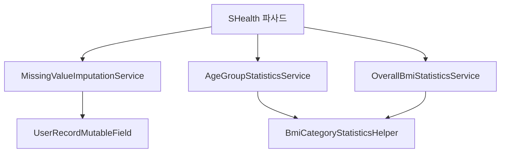

# SHealth_01 — Agent 대화 전문 (04-2. 신규 기능 2차 리팩토링)

_Exported from Cursor AI session on 2026-05-20_  
_주제: 4-2단계 PCTF 작성 · 4-2 PCTF 실행(2차 리팩토링) · prompting 문서화_

---

## Turn 1

### User

```
추가된 신규기능에 대한 2차 리펙토링을 진행하려고 함.
- 네이밍 개선
- 하드코드 및 전역변수 제거 
- 함수 추출
- 반복/중복 제거

를 해결하기 위한, PCTF 방식으로 PROMPT 를 만들어줘
작업프롬프트 폴더에 있는 pctf 프롬프트들을 참고.
산출물에 docs 폴더에 리팩토링 체크리스트 문서를 만드는 것도 포함해줘, 그리고 참고문서에 대한 것도 포함해줘
만들어진 prompt 는 작업프롬프트폴더에 4-2단계 저장해줘
```

### Cursor

- 기존 `2단계_PCTF.md`, `3-2단계_PCTF.md`, `4단계_PCTF.md`, `00.작업프롬프트_목차.md` 형식 참조
- **`작업프롬프트/4-2단계_PCTF.md`** 신규 작성
  - [P] 4단계 신규·분리 코드 2차 리팩토링 시니어 Java
  - [C] 2단계(1차) vs 4-2(2차) 범위 구분, 참조 문서 17개 표
  - [T] 4-2-0~4-2-4 순서 (네이밍 → 하드코드·전역 → 추출 → DRY)
  - [F] `docs/04-2.S_Health_2차리팩토링_체크리스트.md` + `Report/04-2.*` + 코드 + `mvn clean test` Green
  - 복사용 (한 블록) 섹션 포함
- **`작업프롬프트/00.작업프롬프트_목차.md`** 갱신
  - 4-2단계 행·Report 명명·mermaid `S42` 노드 추가

---

## Turn 2

### User

**첨부:** `@4-2단계_PCTF.md` (244-289) — 복사용 (한 블록) 전체

```
첨부:
@작업프롬프트/4-2단계_PCTF.md
@작업프롬프트/4단계_PCTF.md
@작업시나리오
@SHealthRequirements.txt
@.cursorrules
@Report/04.S_Health_기능개선_보고서.md
@docs/02.S_Health_1차리팩토링_체크리스트.md
@Report/02.S_Health_1차리팩토링_보고서.md
@docs/03.S_Health_단위테스트계획서.md
@Report/03.S_Health_단위테스트_보고서.md
@docs/03-2.S_Health_결함_레지스터.md
@docs/03-2.S_Health_권장사항_레지스터.md
@Report/03-2.S_Health_결함및권장사항_통합보고서.md
@src/main/java/com/bestreviewer/
@src/test/java/com/bestreviewer/

[P] 4단계 신규·분리 코드 2차 리팩토링 시니어 Java. SHealthRequirements.txt 규칙·3·4단계 TC 동작 유지. 신규 기능·DEF 수정 금지.

[C] 4단계 Green·SRP 클래스 존재. 2단계=1차(SHealth 레거시), 4-2=2차(4단계 범위). 순서: 네이밍→하드코드·전역→함수 추출→DRY.
… (4-2 PCTF [T][F] 전문)

mvn clean test 전체 Green. 한국어.
```

### Cursor

**4-2-0** — `mvn clean test` 기준선 **Green** (40 tests)

**4-2-1 네이밍**

| Before | After |
|--------|-------|
| `users` | `loadedUserRecords` |
| `ageGroupStatistics` | `ageGroupStatisticsService` |
| `overallStatistics` | `overallBmiStatisticsService` |
| `csvReader` | `csvUserRecordReader` |

**4-2-2 하드코드·전역**

- `resetPipelineState()` — 파이프라인 상태 초기화 응집
- `UserRecordMutableField` — 체중·키 보정 필드 접근 (enum identity 제거)
- `BmiCategoryStatisticsHelper.CATEGORY_COUNT` — 매직 `4` 제거

**4-2-3 함수 추출**

| 클래스 | 추출 메서드 |
|--------|-------------|
| `SHealth` | `resetPipelineState`, `loadUserRecordsFromFile`, `imputeMissingWeightsAndHeights`, `buildStatisticsServices` |
| `MissingValueImputationService` | `computeNonZeroAverageInAgeGroup`, `imputeMissingValuesInAgeGroup` |
| `CsvUserRecordReader` | `skipHeaderLine`, `readUserRecordLines`, `parseUserRecordLine` |

**4-2-4 DRY**

- **`BmiCategoryStatisticsHelper`** (신규) — 나이대·전체 분류 건수·비율(%) 공통
- 체중·키 보정 → `UserRecordMutableField.WEIGHT` / `HEIGHT` 단일 알고리즘
- **`SHealthBMI`** — 6회 `printf` → `AGE_GROUP_STARTS` 루프 (REC-12)

**신규 main 클래스**

- `UserRecordMutableField.java`
- `BmiCategoryStatisticsHelper.java`

**산출물**

| 파일 | 설명 |
|------|------|
| `docs/04-2.S_Health_2차리팩토링_체크리스트.md` | §0~§5 체크리스트·검증 |
| `Report/04-2.S_Health_2차리팩토링_보고서.md` | §1~§7 요약 |

**검증:** `mvn clean test` — **Tests run: 40, Failures: 0, BUILD SUCCESS**

**유지·제외**

- public API 시그니처·동작 유지
- DEF-xx(Test-Locked) 규칙 변경 없음
- 2단계 완료 항목 재작업 없음

---

## Turn 3

### User

```
prompting 폴더에 agent 와 대화한 전체내용을 새로운 파일에 저장하고 내가 입력한 prompt 는 "S_Health_prompt_user" 파일에 덧붙여줘
```

### Cursor

_(본 문서 및 `S_Health_prompt_user.md` Prompt 35~37 갱신)_

---

## 세션 산출물 일람

| 파일 | 설명 |
|------|------|
| `작업프롬프트/4-2단계_PCTF.md` | 4-2단계 PCTF (Turn 1) |
| `작업프롬프트/00.작업프롬프트_목차.md` | 4-2 목차·의존 관계 |
| `src/main/java/com/bestreviewer/UserRecordMutableField.java` | 체중·키 mutable 필드 (Turn 2) |
| `src/main/java/com/bestreviewer/BmiCategoryStatisticsHelper.java` | 집계·비율 DRY (Turn 2) |
| `src/main/java/com/bestreviewer/SHealth.java` 등 | 2차 리팩토링 (Turn 2) |
| `src/main/java/com/bestreviewer/SHealthBMI.java` | 나이대 루프 DRY (Turn 2) |
| `docs/04-2.S_Health_2차리팩토링_체크리스트.md` | 4-2 체크리스트 |
| `Report/04-2.S_Health_2차리팩토링_보고서.md` | 4-2 보고서 |
| `prompting/S_Health_prompt_user.md` | 사용자 프롬프트 누적 |
| `prompting/04-2.S_Health_2차리팩토링_prompt.md` | 본 대화 전문 |

---

## Agent 도구 사용 요약

| Turn | 주요 도구 |
|------|-----------|
| 1 | Glob, Read (`4단계`, `3-2`, `2단계`, 목차, 작업시나리오), Write (`4-2단계_PCTF.md`), StrReplace (`00.작업프롬프트_목차.md`) |
| 2 | Read (main 12클래스, REC 레지스터), Write (리팩토링 8파일), StrReplace (`BmiCategoryStatisticsHelper` typo), Shell (`mvn clean test`), Write (docs·Report 04-2) |
| 3 | Write (prompting), StrReplace (`S_Health_prompt_user`) |

---

## 4-2 리팩토링 후 패키지 구조 (요약)



---

_End of transcript_
