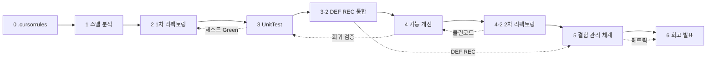

# 작업프롬프트 목차 — SHealth BMI (PCTF)

_생성형 AI 활용 Activities · `작업시나리오` · `.cursorrules` 기준_  
_단계 번호: 2026-05-20 갱신 (5단계 결함 관리 체계 추가, 회고 6단계)_

---

## PCTF란?

| 구분 | 항목 | 설명 |
|------|------|------|
| **P** | Persona | AI가 맡을 역할 (시니어 Java 엔지니어, QA 등) |
| **C** | Context | 프로젝트·문서·선행 단계·제약 |
| **T** | Task | 수행할 작업 (순서·범위 명시) |
| **F** | Format | 산출물 형식·경로·검증 방법 |

---

## 단계별 프롬프트

| 단계 | 시간 | 주제 | 프롬프트 파일 | 주요 산출물 |
|------|------|------|---------------|-------------|
| 0 | - | `.cursorrules` 초안 | (목차 내 예시 참고) | `.cursorrules` |
| **1** | 1h | 코드 스멜 분석 | [`1단계_PCTF.md`](./1단계_PCTF.md) | `docs/01.S_Health_코드스멜_분석보고서.md` |
| **2** | 1h | 1차 리팩토링 (클린코드) | [`2단계_PCTF.md`](./2단계_PCTF.md) | `docs/02.S_Health_1차리팩토링_체크리스트.md`, `Report/02.*` |
| **3** | 1h | UnitTest 작성 | [`3단계_PCTF.md`](./3단계_PCTF.md) | `src/test/java/com/bestreviewer/*`, `Report/03.*` |
| **3-2** | (3단계 내) | 결함·권장사항 통합 | [`3-2단계_PCTF.md`](./3-2단계_PCTF.md) | `docs/03-2.*`, `Report/03-2.*` |
| **4** | 2h | 기능 개선 (SRP·신규 API) | [`4단계_PCTF.md`](./4단계_PCTF.md) | 분리된 도메인 클래스·신규 TC |
| **4-2** | (4단계 내) | 신규 기능 2차 리팩토링 | [`4-2단계_PCTF.md`](./4-2단계_PCTF.md) | `docs/04-2.*`, `Report/04-2.*` |
| **5** | ~1h | 결함 관리·품질 보고 체계 | [`5단계_PCTF.md`](./5단계_PCTF.md) | `docs/05.*`, `Report/05.S_Health_결함관리체계_보고서.md` |
| **6** | 1h | 회고 및 발표 | [`6단계_PCTF.md`](./6단계_PCTF.md) | `Report/06.S_Health_회고및발표.md` |

---

## Cursor 사용 방법

1. 해당 단계 `N단계_PCTF.md`를 연다.
2. **복사용 (한 블록)** 섹션을 채팅에 붙여 넣거나, 전체 PCTF를 `@` 첨부한다.
3. **Cursor 첨부 권장** 파일을 함께 `@` 로 지정한다.
4. 이전 단계 산출물이 있으면 함께 첨부한다.

**공통 첨부 (권장):** `@작업시나리오` `@README.md` `@.cursorrules` `@SHealthRequirements.txt`

---

## 작업시나리오 요약

```
1. 문제 코드 분석 및 코드 스멜 찾기
2. 1차 리펙토링 — 네이밍 → 하드코드·전역 제거 → 함수 추출 → DRY
3. UnitTest — BMI / 나이대 보정 / 4분류 / 예외
4. 기능 개선 — SRP, 연령대 비율, height 0 보정, 정상 BMI 목록, 전체 범주 비율
4-2. (4단계 내) 신규 기능 2차 리팩토링
5. 결함 관리 — 분류 체계 · 보고서 템플릿 · 품질 메트릭 수집 계획
6. 회고 및 발표 — 목표·Before/After·AI·TC·클린코드·품질 메트릭
```

**주의:** Java/Python 등 필요 시 외부 모듈 사용 허용 (`작업시나리오`).

---

## 0단계 — .cursorrules 초안 (참고용 PCTF)

```
[P] 레거시 코드 QA/리팩토링 시니어 Java 엔지니어
[C] SAMSUNG HEALTH BMI — SHealthRequirements.txt, 작업시나리오
[T] Java 8 + Maven + JUnit 5 규칙, BMI·보정·분류·테스트·리팩토링 절대 규칙 작성
[F] 프로젝트 루트 .cursorrules
```

_(완료 시 프로젝트 루트 `.cursorrules` 참조)_

---

## 단계 의존 관계



- **2→3:** 리팩토링 후 테스트 추가.
- **3→3-2:** TC Green 후 DEF/REC 통합.
- **4·4-2:** 3단계 Green 권장.
- **5:** 4-2 완료 후. 코드 수정 없음. 3-2 레지스터 기반 체계·템플릿·메트릭.
- **6:** 코드 수정 없음. 1~5 산출물·메트릭 스냅샷 인용.

---

## Report / docs 폴더 명명 규칙 (권장)

| 단계 | 파일명 예시 |
|------|-------------|
| 1 | `Report/01.S_Health_code_smell_보고서.md` |
| 2 | `docs/02.S_Health_1차리팩토링_체크리스트.md`, `Report/02.*` |
| 3 | `Report/03.S_Health_단위테스트_보고서.md`, `docs/03.S_Health_단위테스트계획서.md` |
| 3-2 | `docs/03-2.S_Health_결함_레지스터.md`, `docs/03-2.S_Health_권장사항_레지스터.md`, `Report/03-2.*` |
| 4 | `Report/04.S_Health_기능개선_보고서.md` |
| 4-2 | `docs/04-2.S_Health_2차리팩토링_체크리스트.md`, `Report/04-2.*` |
| 5 | `docs/05.S_Health_결함분류체계.md`, `docs/05.S_Health_보고서템플릿.md`, `docs/05.S_Health_품질메트릭수집계획.md`, `Report/05.S_Health_결함관리체계_보고서.md` |
| 6 | `Report/06.S_Health_회고및발표.md` |

---

## 3-2 vs 5단계 구분

| | 3-2단계 | 5단계 |
|---|---------|-------|
| **질문** | 무엇이 잘못·부족한가? (통합) | 어떻게 관리·보고·측정할 것인가? (체계) |
| **산출** | DEF/REC 레지스터 | 분류 체계·템플릿·메트릭 계획 |
